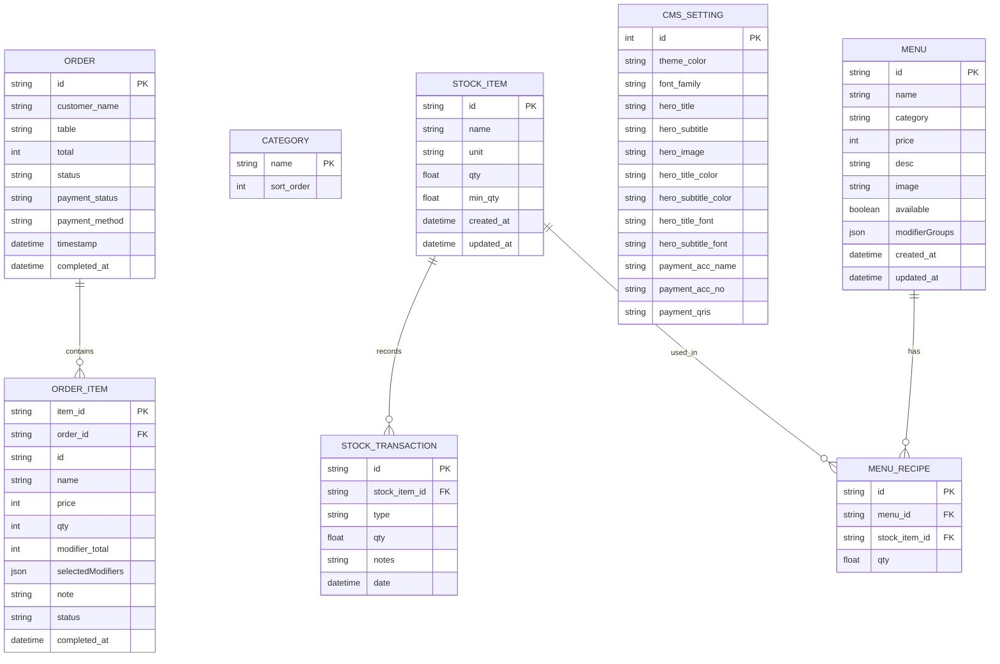

# Rekapitulasi Proyek & Dokumentasi Arsitektur Rakit Coffee

Dokumen ini menyajikan rekapitulasi menyeluruh mengenai arsitektur sistem, struktur database, alur kerja transaksi, serta pemetaan diagram operasional untuk sistem **Rakit Coffee E-Ordering & Kitchen Display System (KDS)**.

---

## 1. Use Case Diagram
Diagram ini memetakan interaksi pengguna (Aktor) terhadap fitur-fitur yang disediakan oleh sistem Rakit Coffee di halaman pelanggan maupun panel admin.

```mermaid
graph TD
    %% Actors
    subgraph Aktor
        Pelanggan["Pelanggan (Customer)"]
        Kasir["Staf Kasir"]
        Dapur["Staf Dapur / Barista"]
        Admin["Admin / Cafe Owner"]
    end

    %% Use Cases
    subgraph "Halaman Pelanggan (Frontend)"
        UC1["Pindai QR & Lihat Menu"]
        UC2["Pilih Menu & Kustomisasi (Sugar/Ice)"]
        UC3["Duplikasi & Edit Item Keranjang"]
        UC4["Checkout Pesanan (QRIS/VA/Kasir)"]
        UC5["Lacak Status & Unduh Invoice"]
    end

    subgraph "Panel Admin & KDS (Backend/CMS)"
        UC6["Pantau & Update Status KDS (Dapur)"]
        UC7["Kelola Stok Bahan Baku (Inventory)"]
        UC8["Konfigurasi CMS & Informasi Rekening/QRIS"]
        UC9["Lihat Dashboard Laporan Penjualan & Keuangan"]
        UC10["Verifikasi Pembayaran Manual Kasir"]
    end

    %% Links
    Pelanggan --> UC1
    Pelanggan --> UC2
    Pelanggan --> UC3
    Pelanggan --> UC4
    Pelanggan --> UC5

    Kasir --> UC10
    Kasir --> UC6

    Dapur --> UC6

    Admin --> UC7
    Admin --> UC8
    Admin --> UC9
    Admin --> UC10
```



### Penjelasan Aktor & Hak Akses:
1. **Pelanggan:** Memiliki akses tanpa autentikasi melalui pemindaian QR Code meja untuk melihat menu, menyesuaikan rasa item keranjang secara individual (misal gula/es), melakukan pembayaran simulasi, memantau pesanan, serta mengunduh invoice digital PNG.
2. **Staf Dapur / Barista:** Berinteraksi dengan KDS untuk melihat detail pesanan dapur berdasarkan nomor meja dan memperbarui status hidangan (Diterima $\rightarrow$ Dimasak $\rightarrow$ Siap Diantar).
3. **Staf Kasir:** Memverifikasi pembayaran manual (Tunai/Debit) dari pelanggan di kasir, mengubah status bayar menjadi Lunas, dan mencetak nota fisik.
4. **Admin / Cafe Owner:** Pengelola penuh sistem yang berhak mengedit katalog menu, memantau visual grafik pendapatan, menyesuaikan stok bahan baku kafe, dan mengunggah barcode QRIS serta rekening VA melalui panel CMS.

---

## 2. Sequence Diagram (Alur Pesanan, Pembayaran & Dapur)
Diagram ini menjelaskan urutan pesan dan interaksi antar komponen sistem mulai dari pemesanan hingga makanan siap diantar.

```mermaid
sequenceDiagram
    autonumber
    actor Pelanggan as Pelanggan (Browser)
    actor Admin as Admin / Kasir (Panel)
    actor Dapur as Barista / Koki (KDS)
    participant API as Backend Server (Node.js)
    database DB as Database (PostgreSQL)

    %% 1. Order Flow
    Note over Pelanggan, DB: Alur Pemesanan & Kustomisasi
    Pelanggan->>API: GET /api/menus & GET /api/cms
    API->>DB: Query Menu & CMS Settings
    DB-->>API: Data Menu & Warna/Pembayaran
    API-->>Pelanggan: Render UI Kustom & Pembayaran Dinamis
    Pelanggan->>Pelanggan: Kustomisasi & Duplikasi Item Keranjang
    Pelanggan->>API: POST /api/orders (Data Order & Detail Item)
    API->>DB: Insert Order & OrderItems (Status: Belum Bayar)
    DB-->>API: Confirm
    API-->>Pelanggan: Return Order ID (ORD-XXXX)

    %% 2. Payment Flow
    Note over Pelanggan, DB: Alur Pembayaran Dinamis
    Pelanggan->>Pelanggan: Buka Modal Pembayaran (Ambil QRIS/VA dari CMS Settings)
    Pelanggan->>API: POST /api/orders/:id/pay (Simulasi Pembayaran)
    API->>DB: Update Payment Status = Lunas
    API->>DB: Kurangi Stok Bahan Baku Otomatis via Resep (MenuRecipe)
    DB-->>API: Success
    API-->>Pelanggan: Update Status Pembayaran Lunas di HP

    %% 3. Kitchen Processing
    Note over Pelanggan, DB: Alur Pemrosesan Dapur & Pelacakan
    Dapur->>API: GET /api/orders (KDS Monitor)
    API->>DB: Query Active Orders
    DB-->>API: List Orders
    Dapur->>API: PUT /api/orders/:id/status (Ubah status: Diterima -> Dimasak -> Siap)
    API->>DB: Update Order Status = Siap
    DB-->>API: Success
    Pelanggan->>API: GET /api/orders/:id (Polling Status)
    API-->>Pelanggan: Status: Siap Diantar!
    Pelanggan->>Pelanggan: Lihat & Unduh Invoice Fisik PNG
```

---

## 3. Entity Relationship Diagram (ERD)
Diagram ini menjelaskan hubungan relasi antar tabel data di dalam PostgreSQL menggunakan generator Prisma ORM.



---

## 4. Skema Database Relasional (Relational Schema)

### A. Tabel `menus`
Menyimpan daftar seluruh katalog makanan, minuman, dan konfigurasi kustomisasi rasa (*modifier*).
* **Primary Key:** `id` (`VARCHAR(50)`)
* **Kolom:**
  * `name` (`VARCHAR(150)`) — Nama item menu.
  * `category` (`VARCHAR(50)`) — Nama kategori (relasi ke tabel `categories`).
  * `desc` (`TEXT`, Nullable) — Deskripsi rasa/bahan.
  * `price` (`INT`) — Harga satuan menu.
  * `image` (`TEXT`, Nullable) — URL gambar menu.
  * `available` (`BOOLEAN`, Default: `true`) — Status ketersediaan menu untuk dipesan.
  * `modifierGroups` (`JSON`, Nullable) — Pilihan kustomisasi rasa (misal: Kadar Gula: Less/Normal).

### B. Tabel `categories`
Menyimpan nama-nama kategori menu beserta urutan sorting penampilannya di frontend.
* **Primary Key:** `name` (`VARCHAR(50)`)
* **Kolom:**
  * `sort_order` (`INT`, Default: `0`) — Urutan tampilan tab kategori.

### C. Tabel `orders`
Header transaksi penjualan dari pesanan meja pelanggan.
* **Primary Key:** `id` (`VARCHAR(20)`) — Format: `ORD-YYYYMMDD-XXXX`
* **Kolom:**
  * `customer_name` (`VARCHAR(100)`) — Nama pelanggan pemesan.
  * `table` (`VARCHAR(20)`) — Nomor meja tempat pemindaian QR.
  * `total` (`INT`) — Total biaya pesanan (termasuk harga kustomisasi).
  * `status` (`VARCHAR(50)`, Default: `"Diterima"`) — Status proses (`Diterima`, `Dimasak`, `Siap`).
  * `payment_status` (`VARCHAR(50)`, Default: `"Belum Bayar"`) — Status bayar (`Belum Bayar`, `Lunas`).
  * `payment_method` (`VARCHAR(50)`) — Cara pembayaran (`QRIS`, `VA`, `Manual`).
  * `timestamp` (`TIMESTAMP`, Default: `now()`) — Waktu pesanan dibuat.
  * `completed_at` (`TIMESTAMP`, Nullable) — Waktu pesanan diselesaikan/diterima pelanggan.

### D. Tabel `order_items`
Menyimpan rincian item-item menu di dalam satu transaksi order.
* **Primary Key:** `item_id` (`VARCHAR(20)`)
* **Foreign Key:** `order_id` (`VARCHAR(20)`) $\rightarrow$ Merujuk ke `orders(id)` (On Cascade Delete).
* **Kolom:**
  * `id` (`VARCHAR(50)`) — Referensi ID menu asli (opsional jika menu dihapus).
  * `name` (`VARCHAR(150)`) — Nama menu saat dipesan (sebagai arsip rekam sejarah).
  * `price` (`INT`) — Harga menu saat dipesan.
  * `qty` (`INT`) — Jumlah pesanan item.
  * `modifier_total` (`INT`, Default: `0`) — Total harga ekstra dari kustomisasi yang dipilih.
  * `selectedModifiers` (`JSON`, Nullable) — Array modifikasi rasa yang dipilih pelanggan secara unik.
  * `note` (`TEXT`, Nullable) — Catatan khusus ke dapur (misal: "Jangan pakai es").
  * `status` (`VARCHAR(50)`) — Status item (`Diterima`, `Dimasak`, `Siap`).

### E. Tabel `cms_settings`
Menyimpan identitas, warna tema global, dan detail informasi rekening pembayaran kafe.
* **Primary Key:** `id` (`INT`, Default: `1`)
* **Kolom:**
  * `theme_color` (`VARCHAR(7)`) — Kode HEX warna utama UI pelanggan.
  * `font_family` (`VARCHAR(100)`) — Jenis font utama.
  * `hero_title` / `hero_subtitle` (`TEXT`) — Teks promosi pada banner atas menu.
  * `hero_image` (`TEXT`) — URL gambar banner utama.
  * `payment_acc_name` (`VARCHAR(100)`) — Nama bank / nama pemilik akun pembayaran.
  * `payment_acc_no` (`VARCHAR(100)`) — Nomor rekening / nomor Virtual Account tujuan transfer.
  * `payment_qris` (`TEXT`, Nullable) — String Base64 dari gambar barcode QRIS kafe.

### F. Tabel `stock_items`
Master inventaris bahan baku mentah yang tersedia di kafe.
* **Primary Key:** `id` (`VARCHAR(50)`)
* **Kolom:**
  * `name` (`VARCHAR(150)`) — Nama bahan baku (misal: Biji Kopi Espresso, Susu UHT).
  * `unit` (`VARCHAR(50)`) — Satuan ukur (kg, liter, gram, pcs).
  * `qty` (`FLOAT`, Default: `0`) — Jumlah stok saat ini.
  * `min_qty` (`FLOAT`, Default: `0`) — Jumlah batas minimal stok sebelum peringatan re-stock.

### G. Tabel `menu_recipes`
Menghubungkan menu dengan bahan baku yang digunakannya beserta komposisi pemakaiannya.
* **Primary Key:** `id` (`VARCHAR(50)`)
* **Foreign Key 1:** `menu_id` (`VARCHAR(50)`) $\rightarrow$ Merujuk ke `menus(id)` (On Cascade Delete).
* **Foreign Key 2:** `stock_item_id` (`VARCHAR(50)`) $\rightarrow$ Merujuk ke `stock_items(id)` (On Cascade Delete).
* **Kolom:**
  * `qty` (`FLOAT`) — Takaran bahan baku yang terpakai untuk membuat 1 porsi menu tersebut.

### H. Tabel `stock_transactions`
Riwayat pencatatan keluar-masuknya stok bahan baku secara detail.
* **Primary Key:** `id` (`VARCHAR(50)`)
* **Foreign Key:** `stock_item_id` (`VARCHAR(50)`) $\rightarrow$ Merujuk ke `stock_items(id)`.
* **Kolom:**
  * `type` (`VARCHAR(20)`) — Jenis transaksi (`IN` untuk barang masuk, `OUT` untuk pemakaian dapur).
  * `qty` (`FLOAT`) — Jumlah volume bahan.
  * `notes` (`TEXT`) — Catatan penjelas transaksi.
  * `date` (`TIMESTAMP`, Default: `now()`).

---

## 5. Mekanisme & Fitur Kunci Sistem

### A. Pengaturan Pembayaran Dinamis (Dynamic Payment CMS)
Pelanggan tidak lagi diarahkan ke nomor pembayaran statis. Seluruh informasi rekening bank virtual account dan gambar barcode QRIS dibaca langsung secara asinkron dari tabel `cms_settings` saat pelanggan masuk ke menu checkout. 

### B. Duplikasi Item Keranjang (Cart Item Duplication)
Pelanggan dapat memesan menu yang sama dengan catatan kustomisasi rasa yang berbeda (misalnya: 1 Caramel Latte manis normal, dan 1 Caramel Latte less sugar). Fitur ini diwadahi oleh tombol salin (`content_copy`) di keranjang yang menggandakan item dengan referensi unik baru agar kustomisasi tidak saling menimpa.

### C. Unduh Invoice Digital Pelanggan (Lihat & Unduh Invoice)
Ketika status pesanan telah dinyatakan siap oleh dapur, pelanggan diberikan akses tombol *"Lihat Invoice"*. Halaman ini akan menghasilkan struk berpenampilan premium yang menampilkan detail nama, meja, daftar pesanan, catatan, waktu, serta total transaksi, yang kemudian dapat diunduh menjadi file gambar PNG berkualitas tinggi berkat pustaka `html2canvas`.

### D. Pengurangan Stok Otomatis Berbasis Resep
Setiap transaksi dengan metode pembayaran QRIS/VA sukses atau konfirmasi manual kasir akan memicu pengurangan inventaris otomatis di backend. Server akan mencari relasi di tabel `menu_recipes`, mengalikan jumlah pesanan pelanggan dengan takaran resep bahan baku, dan mengurangi saldo `qty` bahan terkait pada tabel `stock_items` sekaligus mencatatnya di `stock_transactions`.
